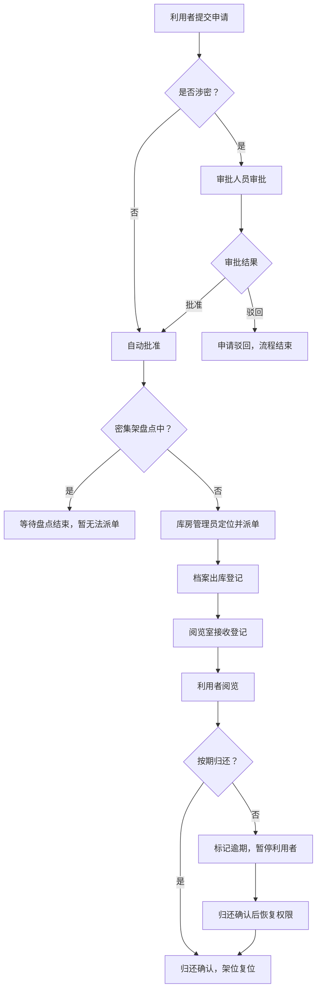

## 1. 产品概述

档案馆密集架调卷管理系统，围绕"利用申请 → 库房调卷 → 阅览归还"三大核心流程设计，实现档案调阅全流程数字化管理。系统通过本地数据联动架位、申请、调卷和逾期状态，支持在容器环境中连续无刷新操作。

- **核心目标**：解决传统档案调卷流程效率低、涉密管控难、逾期追溯差的问题
- **目标用户**：档案利用者、库房管理员、阅览室管理员、档案审批人员

---

## 2. 核心功能

### 2.1 用户角色

| 角色 | 登录方式 | 核心权限 |
|------|---------|---------|
| 利用者 | 账号登录 | 提交调阅申请、查看申请状态、阅览登记、归还确认 |
| 库房管理员 | 账号登录 | 密集架架位管理、派单调卷、盘点管理、出库确认 |
| 阅览室管理员 | 账号登录 | 接收登记、阅览管理、归还确认、逾期提醒 |
| 审批人员 | 账号登录 | 涉密档案审批、申请驳回、审批记录查询 |

### 2.2 功能模块

1. **工作台首页**：数据概览看板、待办事项、快捷入口
2. **利用申请**：调阅申请提交、申请列表、审批流程、状态查询
3. **库房调卷**：密集架架位视图、派单调度、出库登记、盘点管理
4. **阅览归还**：接收登记、阅览管理、归还确认、逾期管理
5. **档案管理**：档案目录、架位维护、涉密标记

### 2.3 页面详情

| 页面名称 | 模块名称 | 功能描述 |
|---------|---------|----------|
| 工作台首页 | 数据概览看板 | 申请数/调卷中/已归还/逾期数统计卡片，今日动态时间线 |
| 工作台首页 | 待办事项 | 待审批/待派单/待接收/逾期未归的快捷列表与跳转 |
| 利用申请 | 申请提交 | 选择档案、填写调阅事由、选择预约阅览时间、涉密提示 |
| 利用申请 | 申请列表 | 按状态筛选（待审批/已批准/已驳回/调卷中/阅览中/已完成/已取消） |
| 利用申请 | 审批流程 | 审批人员批准/驳回，填写审批意见，涉密强制审批 |
| 库房调卷 | 密集架架位 | 可视化密集架分布图，展示架/层/格档案位置与占用状态 |
| 库房调卷 | 派单调度 | 根据申请单定位档案，派单并锁定架位，盘点中禁止派单 |
| 库房调卷 | 出库登记 | 扫描档案编码、确认出库、更新架位状态为"调出" |
| 库房调卷 | 盘点管理 | 启动/结束盘点，盘点期间锁定相关密集架 |
| 阅览归还 | 接收登记 | 接收库房送达档案、核对清单、分配阅览位 |
| 阅览归还 | 阅览管理 | 阅览开始/结束计时、阅览状态监控 |
| 阅览归还 | 归还确认 | 档案归还检查、归还登记、触发架位复位 |
| 阅览归还 | 逾期管理 | 逾期档案列表、发送提醒、暂停利用者新申请权限 |

---

## 3. 核心流程

### 3.1 正常调卷流程
利用者提交调阅申请 → 非涉密自动批准 / 涉密等待审批 → 库房管理员定位密集架并派单 → 档案出库登记 → 阅览室接收登记 → 利用者阅览 → 归还确认 → 架位复位

### 3.2 异常分支
- 涉密档案未审批：禁止派单调出，申请保留在"待审批"状态
- 密集架盘点中：派单时提示"该密集架正在盘点，暂无法派单"
- 逾期未归还：系统自动标记利用者为"暂停"状态，禁止提交新申请

### 3.3 流程图

---

## 4. 用户界面设计

### 4.1 设计风格
- **主色调**：深邃藏青 `#1e3a5f`（专业、沉稳）+ 档案金 `#c9a961`（历史质感）
- **辅助色**：成功绿 `#10b981`、警告橙 `#f59e0b`、危险红 `#ef4444`、信息蓝 `#3b82f6`
- **中性色**：浅灰背景 `#f8fafc`、卡片白 `#ffffff`、深灰文字 `#1e293b`
- **按钮风格**：微圆角 6px、细边框、hover 时轻微上浮阴影，主按钮渐变填充
- **字体**：标题使用思源宋体（Serif，档案质感），正文使用思源黑体（Sans-serif，可读性）
- **图标风格**：Lucide 线性图标，统一 20px 尺寸
- **布局风格**：左侧导航栏 + 顶部面包屑 + 主体卡片式内容区，固定高度容器支持内部滚动
- **质感细节**：卡片使用投影 + 1px 边框，数据表格斑马纹，状态标签使用 pill 胶囊形

### 4.2 页面设计概述

| 页面名称 | 模块名称 | UI 元素 |
|---------|---------|---------|
| 工作台首页 | 数据概览看板 | 4 张渐变统计卡（带趋势小箭头），时间线竖向列表，图标装饰 |
| 工作台首页 | 待办事项 | Tab 切换分类，每行带状态徽章与快捷操作按钮 |
| 利用申请 | 申请提交 | 分步表单（选择档案 → 填写信息 → 确认提交），进度条指示 |
| 利用申请 | 申请列表 | 顶部筛选区 + 数据表格，行内状态徽章与操作按钮 |
| 利用申请 | 审批流程 | 左右分栏：左申请详情，右审批操作区（批准/驳回 + 意见输入） |
| 库房调卷 | 密集架架位 | 3×4 密集架网格，每架展示层/格热区，点击展开档案列表 |
| 库房调卷 | 派单调度 | 申请卡片 + 档案定位高亮 + 派单按钮，盘点中灰色禁用遮罩 |
| 库房调卷 | 出库登记 | 扫描输入框（支持手动）+ 档案核对清单 + 出库确认按钮 |
| 库房调卷 | 盘点管理 | 盘点进度条 + 正在盘点的架位高亮 + 结束盘点按钮 |
| 阅览归还 | 接收登记 | 批次接收卡片 + 档案明细勾选 + 阅览位分配下拉 |
| 阅览归还 | 阅览管理 | 阅览中列表（开始时间计时）+ 结束阅览按钮 |
| 阅览归还 | 归还确认 | 归还档案核对 + 完整性检查 + 归还确认按钮 |
| 阅览归还 | 逾期管理 | 逾期卡片（红色边框 + 逾期天数）+ 发送提醒 + 暂停/恢复按钮 |

### 4.3 响应式
- **设计优先级**：桌面端优先（1440px 基准），适配 1024px 平板
- **布局变化**：窗口宽度 < 1024px 时左侧导航折叠为图标栏，表格转为卡片列表
- **容器支持**：所有页面嵌入固定高度容器（min-h-screen 内部滚动），支持 iframe 集成连续操作
- **交互优化**：表单输入区域增大触摸区域，表格行高 ≥ 48px 便于点击

### 4.4 动效与交互
- **页面切换**：淡入 + 轻微 Y 轴位移（200ms ease-out）
- **状态变更**：状态徽章颜色变化配 pulse 闪烁一次
- **密集架交互**：鼠标悬停架位时轻微放大并显示档案数气泡
- **表单提交**：按钮 loading 态 + 成功后绿色勾号反馈
- **容器连续操作**：所有操作在单页应用内完成，无整页刷新，操作结果即时反馈
