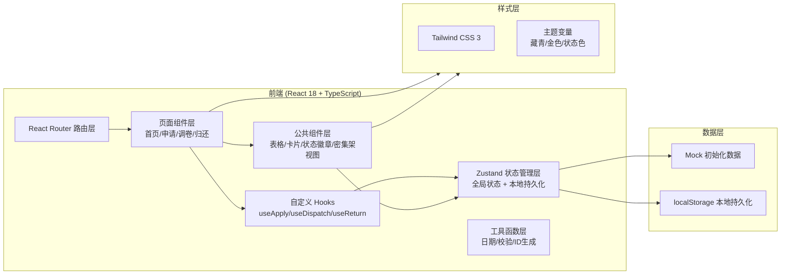
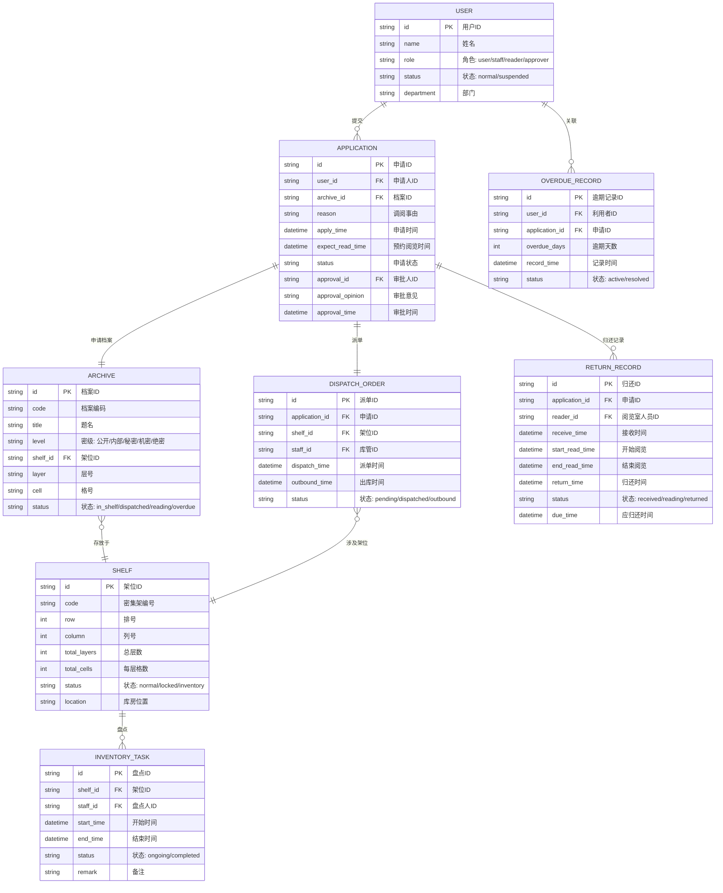

## 1. 架构设计



**核心设计原则**：
- 纯前端单页应用，无后端依赖，所有数据通过 Zustand + localStorage 本地管理
- 状态变更即时联动：架位状态 ↔ 申请状态 ↔ 调卷状态 ↔ 逾期状态
- 支持 iframe 容器嵌入，所有操作在单页内完成无刷新
- 模块化组件，每个页面拆分为独立子组件，便于维护

---

## 2. 技术描述

- **前端框架**：React 18 + TypeScript 5
- **构建工具**：Vite 5（快速 HMR，优化构建）
- **样式方案**：Tailwind CSS 3（原子化 CSS + 自定义主题变量）
- **状态管理**：Zustand 4（轻量状态管理，配合 persist 中间件本地持久化）
- **路由方案**：React Router DOM 6（HashRouter，适配 iframe 容器）
- **图标库**：Lucide React（线性风格图标，与 UI 设计一致）
- **后端服务**：无（纯前端 Mock 数据）
- **数据存储**：localStorage（通过 Zustand persist 中间件自动同步）
- **初始化工具**：vite-init（react-ts 模板）

---

## 3. 路由定义

| 路由路径 | 页面组件 | 功能说明 |
|---------|---------|---------|
| `/dashboard` | Dashboard | 工作台首页：数据概览 + 待办事项 |
| `/application` | ApplicationList | 利用申请列表 |
| `/application/new` | ApplicationNew | 提交新调阅申请 |
| `/application/:id` | ApplicationDetail | 申请详情 + 审批操作 |
| `/dispatch` | DispatchShelf | 库房调卷：密集架架位视图 + 派单 |
| `/dispatch/outbound` | DispatchOutbound | 出库登记 |
| `/dispatch/inventory` | DispatchInventory | 盘点管理 |
| `/return/receive` | ReturnReceive | 阅览室接收登记 |
| `/return/reading` | ReturnReading | 阅览管理 |
| `/return/confirm` | ReturnConfirm | 归还确认 |
| `/return/overdue` | ReturnOverdue | 逾期管理 |
| `*` | Redirect to `/dashboard` | 未匹配路由重定向到首页 |

---

## 4. 数据模型

### 4.1 数据模型 ER 图



### 4.2 状态枚举定义

**档案状态 (ArchiveStatus)**
- `in_shelf` 在架
- `dispatched` 已调出（库房出库）
- `reading` 阅览中（阅览室接收）
- `overdue` 逾期未还

**架位状态 (ShelfStatus)**
- `normal` 正常（可派单）
- `locked` 锁定（特殊维护）
- `inventory` 盘点中（禁止派单）

**申请状态 (ApplicationStatus)**
- `pending_approval` 待审批（涉密档案）
- `approved` 已批准（待派单）
- `rejected` 已驳回
- `dispatching` 调卷中（已派单/出库）
- `reading` 阅览中
- `completed` 已完成（已归还）
- `cancelled` 已取消

**派单状态 (DispatchStatus)**
- `pending` 待出库（已派单）
- `outbound` 已出库

**归还状态 (ReturnStatus)**
- `received` 已接收（待阅览）
- `reading` 阅览中
- `returned` 已归还

**用户状态 (UserStatus)**
- `normal` 正常（可提交申请）
- `suspended` 暂停（有逾期记录，禁止新申请）

---

## 5. 状态管理架构

### 5.1 Zustand Store 切片

```typescript
// 全局 Store 分为 5 个切片，通过 immer 支持可变更新
interface AppStore {
  // === 用户切片 ===
  users: User[];
  currentUser: User | null;
  setCurrentUser: (id: string) => void;
  suspendUser: (userId: string) => void;
  restoreUser: (userId: string) => void;

  // === 档案切片 ===
  archives: Archive[];
  getArchiveByShelf: (shelfId: string) => Archive[];
  updateArchiveStatus: (id: string, status: ArchiveStatus) => void;

  // === 架位切片 ===
  shelves: Shelf[];
  setShelfStatus: (id: string, status: ShelfStatus) => void;
  isShelfAvailable: (shelfId: string) => boolean;

  // === 申请切片 ===
  applications: Application[];
  createApplication: (data: Omit<Application, 'id' | 'apply_time' | 'status'>) => string;
  approveApplication: (id: string, approverId: string, opinion: string) => void;
  rejectApplication: (id: string, approverId: string, opinion: string) => void;

  // === 调卷切片 ===
  dispatchOrders: DispatchOrder[];
  createDispatch: (applicationId: string, staffId: string) => { success: boolean; message: string };
  confirmOutbound: (dispatchId: string) => void;

  // === 归还切片 ===
  returnRecords: ReturnRecord[];
  overdueRecords: OverdueRecord[];
  confirmReceive: (applicationId: string, readerId: string) => void;
  startReading: (returnRecordId: string) => void;
  confirmReturn: (returnRecordId: string) => void;
  checkOverdue: () => void; // 定时检查逾期，自动暂停用户

  // === 盘点切片 ===
  inventoryTasks: InventoryTask[];
  startInventory: (shelfId: string, staffId: string) => void;
  endInventory: (inventoryId: string) => void;

  // === 重置 ===
  resetAll: () => void;
}
```

### 5.2 状态联动规则（核心业务逻辑）

1. **涉密审批联动**：创建申请时，若档案 `level ∈ ['秘密','机密','绝密']`，申请状态自动设为 `pending_approval`，否则直接 `approved`
2. **盘点锁定联动**：`startInventory` 时架位状态设为 `inventory`，此时 `createDispatch` 对该架位档案返回失败
3. **逾期暂停联动**：`checkOverdue` 遍历 `returnRecords`，若 `now() > due_time && status !== 'returned'`，创建逾期记录并将用户状态设为 `suspended`
4. **档案状态联动**：
   - `confirmOutbound` → 档案 `dispatched`
   - `confirmReceive` → 档案 `reading`
   - `confirmReturn` → 档案 `in_shelf`，架位复位
5. **用户申请权限**：`createApplication` 前检查用户 `status === 'suspended'` 时拒绝创建

---

## 6. 项目目录结构

```
src/
├── assets/              # 静态资源（字体、图片）
├── components/          # 公共组件
│   ├── layout/          # 布局组件 Sidebar/Header/Breadcrumb
│   ├── ui/              # 基础组件 Card/Button/Modal/Table/Badge
│   ├── form/            # 表单组件 Stepper/Select/DatePicker
│   └── archive/         # 业务组件 ShelfGridView/ApplicationCard/StatusTimeline
├── hooks/               # 自定义 Hooks
│   ├── useApplication.ts
│   ├── useDispatch.ts
│   ├── useReturn.ts
│   └── useBusinessRules.ts
├── pages/               # 页面组件
│   ├── Dashboard.tsx
│   ├── application/
│   │   ├── List.tsx
│   │   ├── New.tsx
│   │   └── Detail.tsx
│   ├── dispatch/
│   │   ├── ShelfView.tsx
│   │   ├── Outbound.tsx
│   │   └── Inventory.tsx
│   └── return/
│       ├── Receive.tsx
│       ├── Reading.tsx
│       ├── Confirm.tsx
│       └── Overdue.tsx
├── store/               # Zustand Store
│   ├── index.ts         # 导出 useStore
│   ├── slices/          # 各业务切片
│   │   ├── userSlice.ts
│   │   ├── archiveSlice.ts
│   │   ├── shelfSlice.ts
│   │   ├── applicationSlice.ts
│   │   ├── dispatchSlice.ts
│   │   ├── returnSlice.ts
│   │   └── inventorySlice.ts
│   └── mockData.ts      # 初始化 Mock 数据
├── types/               # TypeScript 类型定义
│   └── index.ts
├── utils/               # 工具函数
│   ├── idGenerator.ts
│   ├── dateUtils.ts
│   ├── statusMapper.ts  # 状态 → 中文/颜色映射
│   └── businessRules.ts # 业务规则校验函数
├── router/              # 路由配置
│   └── index.tsx
├── App.tsx
├── main.tsx
└── index.css            # Tailwind + 自定义主题变量
```

---

## 7. Mock 初始化数据清单

用于演示完整流程的预置数据：

| 数据类型 | 数量 | 说明 |
|---------|------|------|
| 用户 | 8 | 2利用者 + 2库管 + 2阅览室 + 2审批人 |
| 密集架 | 12 | 3排×4列，每架6层×4格 |
| 档案 | 80+ | 覆盖不同密级、不同架位、不同状态 |
| 申请单 | 10 | 覆盖各种申请状态（含涉密待审批） |
| 派单 | 5 | 覆盖待出库/已出库 |
| 归还记录 | 8 | 覆盖已接收/阅览中/已归还，含1条逾期 |
| 盘点任务 | 1 | 1个架位正在盘点中 |
